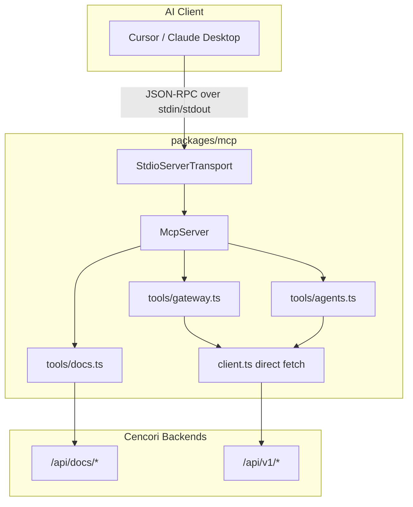
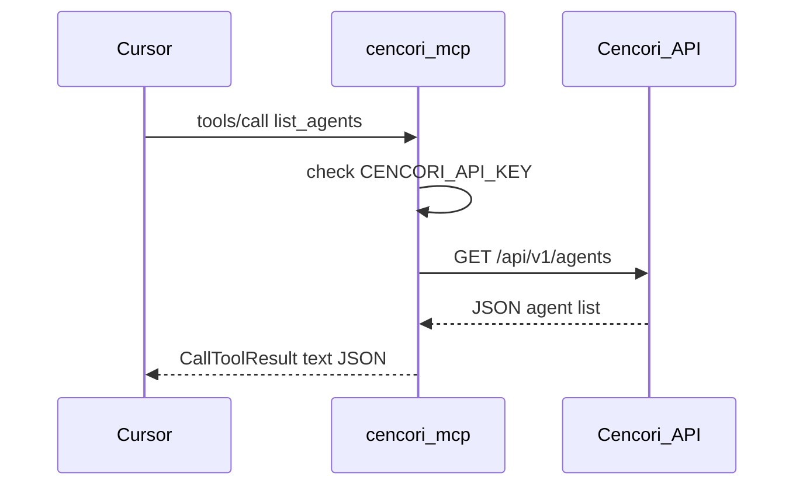

# Cencori MCP — Authoritative v1 Spec

**Status:** v1 implemented (not yet published to npm)  
**Package:** `@cencori/mcp` → [`packages/mcp`](../packages/mcp)  
**Last updated:** July 6, 2026  
**Audience:** Anthony (learning + building), future contributors  
**Related:**
- [deep-research-report.md](./deep-research-report.md) — external MCP research (source material)
- [mcp-v1.md](./mcp-v1.md) — implementation checklist / extended tool reference

---

## How to use this doc

This is the **one doc** for Cencori MCP. It compresses what we learned from Vercel, Supabase, and Anthropic into Cencori-specific decisions. Read it before touching `packages/mcp`.

| Section | Purpose |
|---------|---------|
| §1–2 | Why MCP, what v1 is |
| §3 | Patterns we copied (compressed research) |
| §4–5 | Architecture, access points, code map |
| §6 | Committed v1 tool catalog |
| §7–9 | Auth, deployment, security |
| §10 | Future layers (not v1) |
| §11 | Decision log (update as you build) |
| §12 | Build checklist |
| §13 | Testing and verification |
| §14 | Troubleshooting |

> **Learning note:** MCP servers are thin adapters. Vercel/Supabase don't put business logic in MCP — they call existing APIs. We do the same: MCP → `PlatformClient` / `DocsClient` → `/api/docs/*` and `/api/v1/*`.

---

## 1. Why MCP / Why now

Cencori already has docs, a gateway, agents, memory, scan, and SDKs. Developers use Cursor and Claude to build on top of Cencori. **MCP is the standard way** for those clients to call your platform as tools — without custom integrations per IDE.

**What we're doing:** reverse-engineering existing MCPs (Vercel, Supabase), extracting patterns, and building **our** version against Cencori's real APIs.

**What v1 is not:** a full API mirror, a chat proxy, or a hosted OAuth product (yet).

---

## 2. What Cencori MCP v1 is

| Attribute | v1 decision |
|-----------|-------------|
| **Product** | Curated read-only tools for docs + gateway + agents |
| **Transport** | Stdio (local process spawned by Cursor/Claude) |
| **Distribution** | `npx @cencori/mcp` |
| **Auth (public tier)** | None — docs tools always work |
| **Auth (platform tier)** | `CENCORI_API_KEY` (`csk_...`) in MCP env |
| **Writes** | Out of scope |
| **OAuth / hosted remote** | Documented as v2, not built in v1 |

### v1 committed scope (7 tools)

| Tier | Tools | Status |
|------|-------|--------|
| **Public** | `search_docs`, `get_doc`, `list_docs` | ✅ Shipped |
| **Platform** | `list_models`, `get_metrics`, `list_agents`, `get_agent` | ✅ Shipped |

Everything else (memory, billing, scan, logs, writes) is **future** — see §10.

---

## 3. Patterns we copied (compressed research)

Source: [deep-research-report.md](./deep-research-report.md). This section is the compression — read the full report for depth.

### 3.1 Universal MCP shape

All serious MCP implementations share:

1. **Tool catalog** — named tools with typed input/output schemas, exposed at `initialize` / `tools/list`
2. **JSON-RPC** — `tools/call` with structured args and text/JSON results
3. **Thin adapter** — MCP layer calls existing platform APIs; no duplicate business logic
4. **Curated surface** — ~15–30 intent-shaped tools, not full REST

### 3.2 What each provider taught us

| Provider | Pattern | Cencori adoption |
|----------|---------|------------------|
| **Vercel** | Public docs tools + authenticated project tools in one server | Docs tier (no key) + platform tier (API key) |
| **Vercel** | OAuth for hosted remote MCP | Deferred to v2 |
| **Vercel** | ~20 curated tools (deployments, logs, domains) | We curate gateway/agents first, not every dashboard route |
| **Supabase** | `search_docs` as knowledge-base tool | Same name: `search_docs` |
| **Supabase** | `read_only=true`, `project_ref`, `features=` URL flags | Env vars in v1: `CENCORI_MCP_READ_ONLY`, `CENCORI_MCP_FEATURES` |
| **Supabase** | Open-source `supabase/mcp` repo as reference | Our code lives in `packages/mcp` |
| **Anthropic** | Client connects to external MCP URLs; bearer token in config | v2: `authorization_token` for hosted MCP |
| **Anthropic** | `tool_configuration` allow/deny per session | Future: feature flags env |

### 3.3 What we deliberately differ on (v1)

| Their default | Our v1 |
|---------------|--------|
| Remote HTTPS `/mcp` endpoint | **Stdio-first** — Cursor spawns local process |
| OAuth user consent | **API key only** — simpler for learning and shipping |
| Broad tool surface (29+ tools) | **7 tools** — docs + gateway/agents reads only |
| Writes available (SQL, deploy) | **Read-only** — governance aligns with Cencori brand |

> **Learning note:** Stdio is not "worse" than remote HTTP. Supabase CLI mode is stdio too. Remote MCP (`mcp.cencori.com`) is a distribution upgrade, not a prerequisite.

---

## 4. Architecture

### 4.1 v1 data flow



### 4.2 Request lifecycle (one tool call)



### 4.3 Package layout (shipped)

```
packages/mcp/
├── src/
│   ├── index.ts              # stdio entrypoint (shebang added by tsup at build)
│   ├── server.ts             # createServer() — conditional tool registration
│   ├── config.ts             # env: docs URL, base URL, API key, features, readOnly
│   ├── client.ts             # PlatformClient — direct fetch to /api/v1/*
│   ├── tools.ts              # barrel re-exports for tool groups
│   ├── docs/
│   │   ├── client.ts         # HTTP → /api/docs/*
│   │   └── types.ts
│   └── tools/
│       ├── shared.ts         # readOnly annotations + jsonResult helper
│       ├── docs.ts           # search_docs, get_doc, list_docs
│       ├── gateway.ts        # list_models, get_metrics
│       └── agents.ts         # list_agents, get_agent
├── test/
│   └── integration.test.mjs  # live API + stdio MCP integration tests
├── mcp.example.json          # Cursor config example
├── package.json
├── tsup.config.ts            # adds #!/usr/bin/env node shebang to dist/
└── README.md
```

> **Learning note:** One file per tool category mirrors Supabase's repo organization. `server.ts` stays thin — it only wires config + registrations. `tools.ts` is a barrel, not the tool implementations.

---

## 5. Access points and code map

MCP does not invent new backends. Every tool maps to an existing route or SDK method.

### 5.1 Public docs access (no API key)

| MCP tool | HTTP endpoint | Code |
|----------|---------------|------|
| `search_docs` | `GET /api/docs/search?q=` | [`app/api/docs/search/route.ts`](../app/api/docs/search/route.ts) |
| `get_doc` | `GET /api/docs/raw?slug=` | [`app/api/docs/raw/route.ts`](../app/api/docs/raw/route.ts) |
| `list_docs` | `GET /api/docs/navigation` | [`app/api/docs/navigation/route.ts`](../app/api/docs/navigation/route.ts) |

MCP client: [`packages/mcp/src/docs/client.ts`](../packages/mcp/src/docs/client.ts)  
Tool registration: [`packages/mcp/src/tools/docs.ts`](../packages/mcp/src/tools/docs.ts)

### 5.2 Platform access (API key required)

| MCP tool | HTTP endpoint | MCP client method | Backend route |
|----------|---------------|-------------------|---------------|
| `list_models` | `GET /api/v1/models` | `PlatformClient.listModels()` | [`app/api/v1/models/route.ts`](../app/api/v1/models/route.ts) |
| `get_metrics` | `GET /api/v1/metrics?period=` | `PlatformClient.getMetrics(period)` | [`app/api/v1/metrics/route.ts`](../app/api/v1/metrics/route.ts) |
| `list_agents` | `GET /api/v1/agents` | `PlatformClient.listAgents()` | [`app/api/v1/agents/route.ts`](../app/api/v1/agents/route.ts) |
| `get_agent` | `GET /api/v1/agents/:id` | `PlatformClient.getAgent(id)` | [`app/api/v1/agents/[agentId]/route.ts`](../app/api/v1/agents/[agentId]/route.ts) |

**Auth headers:** `PlatformClient` sends both `Authorization: Bearer csk_...` and `CENCORI_API_KEY: csk_...` (matches gateway middleware).

**Why direct fetch, not the `cencori` npm SDK:** The workspace SDK (`packages/sdk`) has `AgentsNamespace`, but the **published** npm package `cencori@1.2.1` does not expose `cencori.agents` yet. MCP uses direct fetch to `/api/v1/*` for all platform tools until a new SDK version ships. See §11 decision log.

**Metrics periods** supported by API: `1h`, `24h`, `7d`, `30d`, `mtd` (MCP tool default: `7d`; API route default: `24h`).

### 5.3 What v1 does NOT touch (dashboard APIs)

These require session/cookie auth or `projectId` in path — **out of v1 scope**:

| Capability | Route pattern | Why deferred |
|------------|---------------|--------------|
| Gateway log search | `/api/projects/[projectId]/logs/gateway/*` | No machine-to-machine auth on dashboard routes yet |
| Custom rules | `/api/projects/[projectId]/custom-rules/*` | Same |
| Prompts | `/api/projects/[projectId]/prompts/*` | Same |
| Security stats | `/api/projects/[projectId]/security/*` | Same |

v1.1 option: extend `v1` or add MCP-scoped project routes with API key auth.

---

## 6. Tool catalog (v1 committed)

All v1 tools use MCP annotations: `readOnlyHint: true`, `destructiveHint: false`.

### 6.1 Docs (public) — SHIPPED

#### `search_docs`

Search Cencori documentation by keyword.

| Input | Type | Required |
|-------|------|----------|
| `query` | string (min 2 chars) | Yes |

**Returns:** `{ query, count, results: [{ title, description, section, href, snippet, score }] }`

**Example queries:** `"failover"`, `"api keys"`, `"semantic caching"`

---

#### `get_doc`

Fetch raw markdown for a documentation page.

| Input | Type | Required |
|-------|------|----------|
| `slug` | string | Yes |

**Returns:** `{ slug, url, content }` or `{ slug, error }`

**Example slugs:** `quick-start`, `ai/sdk`, `api/chat`, `security/scan`

---

#### `list_docs`

List documentation table of contents by section.

| Input | Type | Required |
|-------|------|----------|
| _(none)_ | — | — |

**Returns:** `{ sections: [{ title, items: [{ title, href, order }] }] }`

---

### 6.2 Gateway (authenticated, read-only) — SHIPPED

Requires `CENCORI_API_KEY`. Register only when key is present at startup.

#### `list_models`

List models available through the Cencori gateway.

| Input | Type | Required |
|-------|------|----------|
| _(none)_ | — | — |

**Returns:** OpenAI-style list: `{ object: "list", data: [{ id, owned_by, context_window, ... }] }`

**Backend:** `GET /api/v1/models` with `Authorization: Bearer csk_...` or `CENCORI_API_KEY` header.

---

#### `get_metrics`

Get gateway usage metrics for the authenticated project.

| Input | Type | Required | Default |
|-------|------|----------|---------|
| `period` | string | No | `7d` |

**Allowed values:** `1h`, `24h`, `7d`, `30d`, `mtd`

**Returns:** Requests, cost, tokens, latency percentiles, per-provider and per-model breakdown.

**Backend:** `GET /api/v1/metrics?period=7d`

---

### 6.3 Agents (authenticated, read-only) — SHIPPED

#### `list_agents`

List agents in the project.

| Input | Type | Required |
|-------|------|----------|
| _(none)_ | — | — |

**Returns:** `{ data: [{ id, name, description, is_active, shadow_mode, created_at }] }`

**Backend:** `GET /api/v1/agents` via `PlatformClient.listAgents()`

---

#### `get_agent`

Get full configuration for one agent.

| Input | Type | Required |
|-------|------|----------|
| `agent_id` | string | Yes |

**Returns:** Agent object including `config: { model, system_prompt, tools, temperature }`

**Backend:** `GET /api/v1/agents/:id` via `PlatformClient.getAgent(agentId)`

**Never return:** full API key material from any tool.

---

## 7. Configuration and auth

### 7.1 Environment variables

| Variable | Required | Default | Purpose |
|----------|----------|---------|---------|
| `CENCORI_DOCS_BASE_URL` | No | `https://cencori.com` | Docs API base |
| `CENCORI_BASE_URL` | No | `https://cencori.com` | Platform API host (MCP appends `/api/v1/*`) |
| `CENCORI_API_KEY` | For platform tools | — | `csk_...` project key |
| `CENCORI_MCP_READ_ONLY` | No | `true` | When true, write tools not registered |
| `CENCORI_MCP_FEATURES` | No | all | Comma list: `docs,gateway,agents` |

### 7.2 Behavior matrix

| Config | Docs tools | Platform tools |
|--------|------------|----------------|
| No API key | Work | Not registered (or clear error if called) |
| API key set | Work | Registered |
| `CENCORI_MCP_FEATURES=docs` | Work | Gateway/agents not registered |

### 7.3 Cursor config examples

**Docs only (zero setup):**

```json
{
  "mcpServers": {
    "cencori": {
      "command": "npx",
      "args": ["-y", "@cencori/mcp"]
    }
  }
}
```

**Full v1 (docs + gateway + agents):**

```json
{
  "mcpServers": {
    "cencori": {
      "command": "npx",
      "args": ["-y", "@cencori/mcp"],
      "env": {
        "CENCORI_API_KEY": "csk_...",
        "CENCORI_MCP_FEATURES": "docs,gateway,agents"
      }
    }
  }
}
```

**Local dev (Next app on :3000):**

```json
{
  "mcpServers": {
    "cencori": {
      "command": "node",
      "args": ["./packages/mcp/dist/index.js"],
      "env": {
        "CENCORI_DOCS_BASE_URL": "http://localhost:3000",
        "CENCORI_BASE_URL": "http://localhost:3000",
        "CENCORI_API_KEY": "csk_..."
      }
    }
  }
}
```

> **Learning note:** The API key lives in MCP config env — same as Supabase PAT in CLI mode. User is responsible for rotation. Never commit keys.

---

## 8. Deployment model

### 8.1 v1: stdio-first

| Attribute | Value |
|-----------|-------|
| **How it runs** | Cursor/Claude spawns `node dist/index.js` or `npx @cencori/mcp` |
| **Transport** | Stdio JSON-RPC (`@modelcontextprotocol/sdk` `StdioServerTransport`) |
| **Network** | Outbound HTTPS only (to cencori.com or localhost) |
| **Scaling** | N/A — one process per IDE session |
| **Publishing** | npm package `@cencori/mcp`, bin `cencori-mcp` |

**Why stdio first:**
- Works in Cursor today with zero hosting cost
- Fastest path to learn MCP tool registration
- Matches Supabase CLI local mode pattern

**Stdio rules:**
- Use `console.error()` for logs — **never** `console.log()` (corrupts JSON-RPC on stdout)
- Shebang `#!/usr/bin/env node` is added by **tsup banner** in `dist/index.js` — do not also put it in `src/index.ts` (duplicate shebang breaks Windows: `SyntaxError: Invalid or unexpected token`)

### 8.2 v2: remote hosted MCP (documented, not built)

| Attribute | Planned value |
|-----------|---------------|
| **URL** | `https://mcp.cencori.com/mcp` |
| **Transport** | Streamable HTTP + SSE |
| **Auth** | OAuth2 user consent (Vercel pattern) |
| **Deployment** | Next.js route or standalone service on GCP Cloud Run |

Same tool registry as stdio — different transport adapter only.

---

## 9. Security

### 9.1 Principles (v1)

1. **Read-only default** — no create/update/delete tools in v1
2. **Public/private split** — docs without credentials; platform with key
3. **Curated tools** — no generic `call_api(method, path, body)`
4. **No chat tool** — host LLM already chats; gateway routing is not an MCP concern in v1
5. **No full secrets in output** — key prefixes only if ever needed

### 9.2 Threat model (simplified)

| Risk | v1 mitigation |
|------|---------------|
| Stolen API key in MCP config | User responsibility; document rotation |
| Prompt injection via agent config in `get_agent` | Read-only limits blast radius; v2 wrap sensitive outputs |
| Tool sprawl confuses LLM | 7 tools, intent-shaped names |
| Path traversal in future scan tool | Not in v1; validate paths when added |

### 9.3 Error shape

Platform tool called without API key:

```json
{
  "error": "CENCORI_API_KEY is required for this tool. Set it in your MCP server env.",
  "code": "MISSING_API_KEY"
}
```

---

## 10. Future layers (not v1)

Document these so we don't scope-creep v1, but know where we're going.

| Layer | Example tools | Blocker |
|-------|---------------|---------|
| **Memory** | `list_memory_namespaces`, `search_memory` | SDK ready; add after gateway/agents |
| **Billing** | `check_quota` | `v1/billing/check-quota` exists |
| **Local scan** | `scan_workspace` | `@cencori/scan` integration |
| **Observability** | `search_gateway_logs`, `get_request_detail` | Dashboard API + project auth |
| **Security** | `list_custom_rules`, `get_security_stats` | Dashboard API |
| **Writes** | `create_agent`, `store_memory` | Requires read_only=false + human-in-the-loop |
| **Hosted MCP** | Remote `/mcp` | OAuth + SSE transport |

See [mcp-v1.md](./mcp-v1.md) for extended tool schemas on future tools.

---

## 11. Decision log

Update this table as you build. This is your learning trail.

| Date | Decision | Rationale | Alternatives considered |
|------|----------|-----------|-------------------------|
| 2026-07 | Stdio-first, not remote HTTP | Cursor works today; no hosting needed | Remote-first like Vercel |
| 2026-07 | API key only for v1 auth | Simplest; matches Supabase CLI/PAT mode | OAuth from day one |
| 2026-07 | v1 scope = docs + gateway/agents reads | SDK + v1 routes exist; no dashboard auth work | Full platform including memory/scan |
| 2026-07 | Tool name `search_docs` not `search_documentation` | Align with Supabase convention | Vercel naming |
| 2026-07 | MCP is thin adapter over existing APIs | Same pattern as Vercel/Supabase | Embed gateway logic in MCP |
| 2026-07 | No `chat` MCP tool | Host already has LLM | Route chat through Cencori as tool |
| 2026-07-06 | Direct fetch for all platform tools | Published `cencori@1.2.1` lacks `agents` namespace; models/metrics never had SDK wrappers | Use npm `cencori` SDK |
| 2026-07-06 | Rename server `cencori-docs` → `cencori` | Reflect expanded scope beyond docs | Keep name for backward compat |
| 2026-07-06 | Shebang only in tsup banner | Duplicate shebang in `src/index.ts` + tsup breaks `node dist/index.js` on Windows | Shebang in source only |
| 2026-07-06 | Integration tests via stdio MCP client | Validates real JSON-RPC path, not just HTTP helpers | Unit tests with mocks only |
| 2026-07-06 | No `cencori` npm dependency in MCP package | SDK on npm is behind workspace; direct fetch is simpler and works today | Add dependency, wait for SDK publish |

---

## 12. Build checklist

Track implementation against this spec. Check boxes as you ship.

### Package structure

- [x] `packages/mcp` created with stdio entry
- [x] Docs tools shipped (`search_docs`, `get_doc`, `list_docs`)
- [x] `DocsClient` → `/api/docs/*`
- [x] Refactor `tools.ts` → `tools/docs.ts` (+ barrel in `tools.ts`)
- [x] Add `config.ts` fields: `apiKey`, `baseUrl`, `features`, `readOnly`
- [x] Add `client.ts` (`PlatformClient` — direct fetch to `/api/v1/*`)
- [x] Add `tools/gateway.ts` (`list_models`, `get_metrics`)
- [x] Add `tools/agents.ts` (`list_agents`, `get_agent`)
- [x] Update `server.ts` to register all tool groups conditionally
- [x] Rename server name `cencori-docs` → `cencori`
- [x] Add integration test suite (`test/integration.test.mjs`)
- [ ] npm publish `@cencori/mcp`

### Per-tool implementation pattern

For each new tool, repeat this loop:

```
1. Define name + zod inputSchema in tools/<category>.ts
2. registerTool() with readOnlyHint: true
3. Handler calls `DocsClient` or `PlatformClient` with API key from config
4. Return `JSON.stringify(result)` as text content via `jsonResult()` helper
5. Run `npm test` in `packages/mcp`
6. Update §11 decision log if you learned something
7. Check box in this section
```

### Testing

- [x] Docs: `search_docs` query `"failover"` returns results
- [x] Docs: `get_doc` slug `ai/sdk` returns markdown
- [x] Gateway: `list_models` returns model list with valid key
- [x] Gateway: `get_metrics` period `7d` returns usage JSON
- [x] Gateway: `list_agents` returns `{ data: [...] }` (may be empty array)
- [ ] Agents: `get_agent` with valid id returns config (skipped if project has no agents)
- [x] No key: platform tools not registered at startup
- [x] Feature flag `CENCORI_MCP_FEATURES=docs` hides platform tools even with key

---

## 13. Testing and verification

### 13.1 Test suite location

Integration tests live at [`packages/mcp/test/integration.test.mjs`](../packages/mcp/test/integration.test.mjs).

They cover two layers:

1. **HTTP layer** — direct `fetch` to production (or `CENCORI_DOCS_BASE_URL`) docs APIs
2. **MCP layer** — spawns `node dist/index.js`, connects via `@modelcontextprotocol/sdk` `StdioClientTransport`, calls `listTools` and `callTool`

### 13.2 Running tests

```bash
cd packages/mcp
npm install
npm test
```

`npm test` runs `npm run build` then `node --test test/integration.test.mjs`.

**Authenticated tests** require `CENCORI_API_KEY` in the environment:

```bash
# PowerShell — load from repo root .env
Get-Content ..\.env | ForEach-Object {
  if ($_ -match '^\s*([^#=\s]+)\s*=\s*(.*)\s*$') {
    [Environment]::SetEnvironmentVariable($matches[1], $matches[2], 'Process')
  }
}
npm test
```

```bash
# Bash
export CENCORI_API_KEY=csk_...
npm test
```

### 13.3 Test matrix (13 cases)

| # | Test | Requires API key | What it verifies |
|---|------|------------------|------------------|
| 1 | docs API search | No | `GET /api/docs/search?q=failover` returns results |
| 2 | docs API get_doc | No | `GET /api/docs/raw?slug=ai/sdk` returns markdown |
| 3 | docs API list_docs | No | `GET /api/docs/navigation` returns sections |
| 4 | MCP docs-only tool list | No | Only 3 docs tools when key unset in child env |
| 5 | MCP search_docs | No | Tool call returns `{ query, count, results }` |
| 6 | MCP get_doc | No | Tool call returns `{ slug, url, content }` |
| 7 | MCP list_docs | No | Tool call returns `{ sections }` |
| 8 | Feature flag docs-only | Yes | With key + `FEATURES=docs`, only 3 tools listed |
| 9 | Full 7-tool registration | Yes | All v1 tools listed with key + all features |
| 10 | list_models | Yes | Returns `{ object: "list", data: [...] }` |
| 11 | get_metrics | Yes | Returns period, requests, cost, tokens, latency |
| 12 | list_agents | Yes | Returns `{ data: [...] }` (empty array is valid) |
| 13 | get_agent | Yes | Fetches first agent config; **skips** if `data` is empty |

**Last verified run (July 6, 2026):** 12 passed, 1 skipped (`get_agent` — no agents in test project).

### 13.4 Manual testing in Cursor

1. Build: `cd packages/mcp && npm run build`
2. Add to `.cursor/mcp.json` (see §7.3)
3. Restart Cursor MCP or reload window
4. Open MCP tools panel — confirm tool list matches your env config
5. Ask the agent: *"Search Cencori docs for failover"* or *"List gateway models"*

### 13.5 What tests do NOT cover (yet)

- npm-published `@cencori/mcp` binary (local `dist/index.js` only)
- Local Next.js app on `:3000` (tests default to `https://cencori.com`)
- Invalid/expired API keys (error shape)
- OAuth / remote MCP transport

---

## 14. Troubleshooting

### 14.1 Platform tools missing from tool list

| Symptom | Cause | Fix |
|---------|-------|-----|
| Only 3 docs tools listed | No `CENCORI_API_KEY` in MCP env | Add key to Cursor MCP config `env` block |
| Only 3 docs tools listed | Typo: `CENCOR_API_KEY` | Must be `CENCORI_API_KEY` (with **I**) |
| Gateway tools missing, agents present | `CENCORI_MCP_FEATURES=agents` | Set to `docs,gateway,agents` or omit (defaults to all) |
| All 7 tools when you wanted docs only | Key set + default features | Set `CENCORI_MCP_FEATURES=docs` |

Platform tools are registered **at server startup** only when `CENCORI_API_KEY` is present. Changing env requires restarting the MCP server process (reload Cursor MCP).

### 14.2 Server crashes immediately on Windows

**Symptom:** `SyntaxError: Invalid or unexpected token` at `#!/usr/bin/env node`

**Cause:** Duplicate shebang — both `src/index.ts` and `tsup.config.ts` banner add shebang to `dist/index.js`.

**Fix:** Shebang belongs in `tsup.config.ts` banner only. `src/index.ts` must not contain `#!/usr/bin/env node`.

### 14.3 Agent tools return plain-text error, not JSON

**Symptom:** `list_agents` / `get_agent` return text like `Cannot read properties of undefined (reading 'list')`

**Cause:** Using published `cencori` npm SDK before `agents` namespace shipped. `cencori.agents` is `undefined` on npm 1.2.1.

**Fix:** Use `PlatformClient` direct fetch (current implementation). Revisit SDK dependency after publishing workspace SDK with agents.

### 14.4 `get_agent` test skipped

**Symptom:** Test output shows `SKIP No agents in project`

**Cause:** Valid — `list_agents` returned `{ data: [] }`. The tool works; there is nothing to fetch.

**Fix:** Create an agent in the Cencori dashboard for the project tied to your API key, then re-run tests.

### 14.5 Stdio / JSON-RPC corruption

| Do | Don't |
|----|-------|
| `console.error('debug info')` | `console.log()` on stdout |
| Return tool results as JSON text in `content[0].text` | Log responses to stdout |

Stdout is reserved for MCP JSON-RPC messages between client and server.

### 14.6 Local dev against Next.js

When running the Cencori app locally:

```json
"env": {
  "CENCORI_DOCS_BASE_URL": "http://localhost:3000",
  "CENCORI_BASE_URL": "http://localhost:3000",
  "CENCORI_API_KEY": "csk_..."
}
```

Both base URLs must point at the Next app root. MCP constructs platform URLs as `{CENCORI_BASE_URL}/api/v1/...`.

---

## Appendix A — Comparison at a glance

| | Vercel MCP | Supabase MCP | Cencori MCP v1 |
|--|------------|--------------|----------------|
| Transport | Remote HTTP | Remote HTTP + CLI stdio | **Stdio** |
| Auth | OAuth | OAuth + PAT | **API key** |
| Public tools | Docs search | Docs search | **Docs (3 tools)** |
| First private tools | Projects, deploys | SQL, logs | **Gateway, agents** |
| Open source | No official repo | `supabase/mcp` | `packages/mcp` |
| Read-only mode | Implicit for some | `read_only=true` flag | **Default, no writes** |

---

## Appendix B — References

- [deep-research-report.md](./deep-research-report.md)
- [mcp-v1.md](./mcp-v1.md) — extended schemas and future tools
- [MCP spec](https://modelcontextprotocol.io)
- [Vercel MCP tools](https://vercel.com/docs/agent-resources/vercel-mcp/tools)
- [Supabase MCP](https://github.com/supabase/mcp)
- Package: [`packages/mcp/README.md`](../packages/mcp/README.md)
- Publishing: [`packages/PUBLISHING.md`](../packages/PUBLISHING.md)
